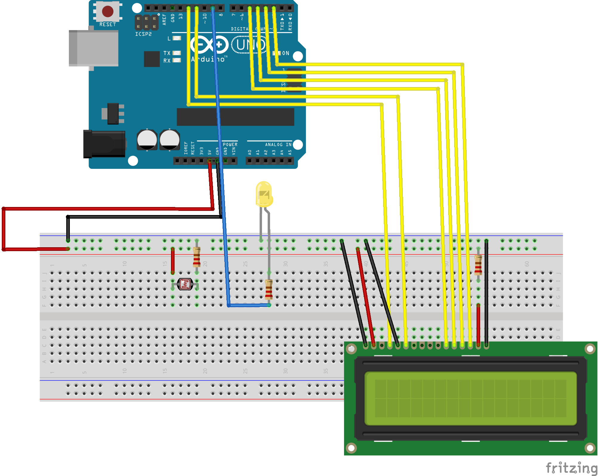

# GoodLight_BadUSB
Task under "Embedded System Lab Training SS_2018" course, RCSE

### Breadboard

### Required Components
- Arduino Uno Board with USB connector
- Breadboard
- LCD Screen (compatible with Hitachi HD44780 driver)
- LDR(Light-Dependent Resistor)/Photocell
- LED
- 220 ohm resistor x 4
- Jumper wires x 30

### Schematic

### Functional Requirements
- LDR(Light-Dependent Resistor) should continuously sense the intensity of the surrounding Light.
- If the surrounding light intensity is High:
  - Do Nothing.
- If the surrounding light intensity is Low:
  - After 1 minute display a pop-up on monitor with message "Light Intensity is Low. Please increase the Light Intensity."
  - Wait for 5 minutes so that user can increase the light intensity.
  - If person doesn't increase the light intensity:
    - Perform the action i.e. Lock the PC screen.
  - If user increase the light intensity:
    - Do Nothing.

### References
https://www.arduino.cc/en/Tutorial/HelloWorld
