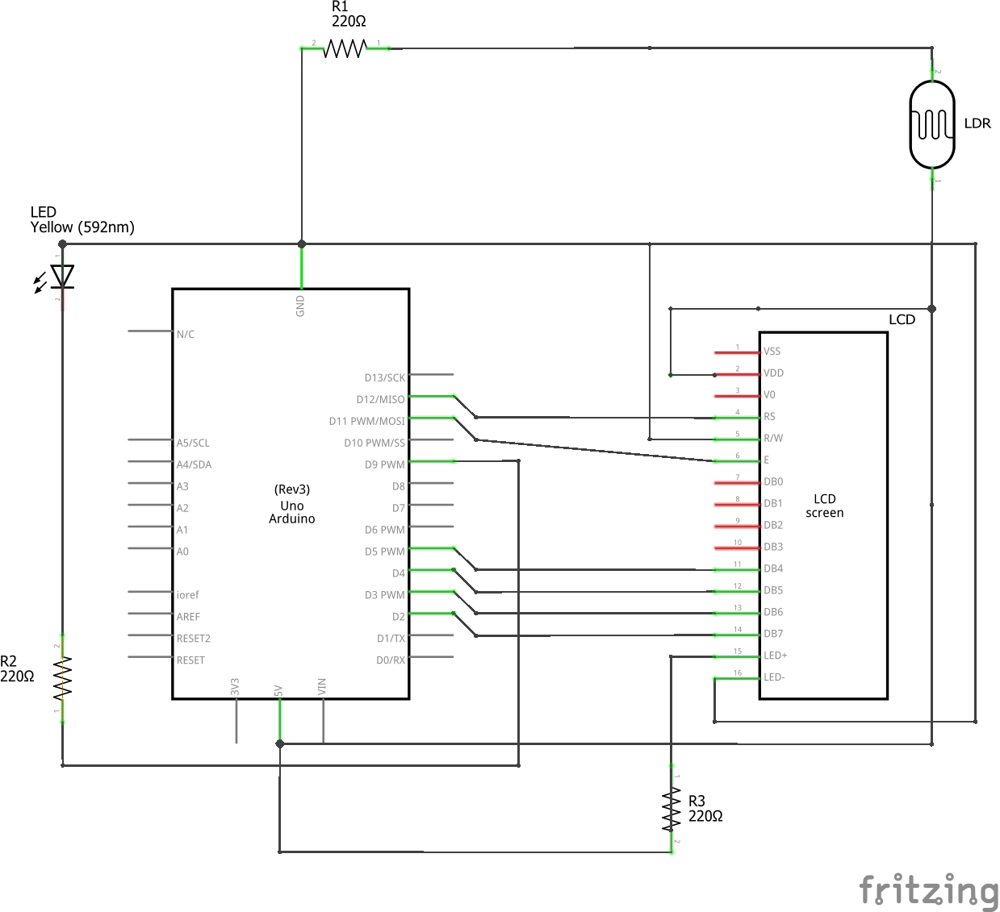

# GoodLight_BadUSB
Project under "Embedded System Lab Training SS_2018" course, RCSE

### Breadboard

### Required Components
- Arduino Uno Board with USB connector
- Breadboard
- LCD Screen (compatible with Hitachi HD44780 driver)
- Photocell(LDR)
- Buzzer
- Red LED
- 10k ohm Potentiometer
- 220 ohm resistor x 4
- Jumper wires x 30

### Schematic

### References
https://www.arduino.cc/en/Tutorial/HelloWorld 
